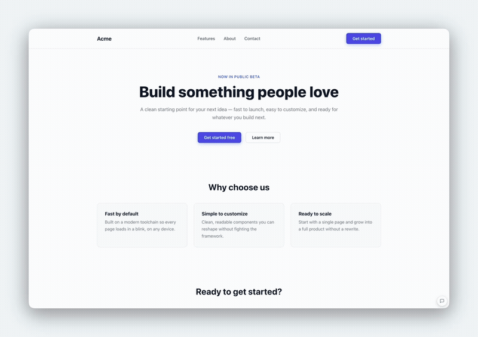
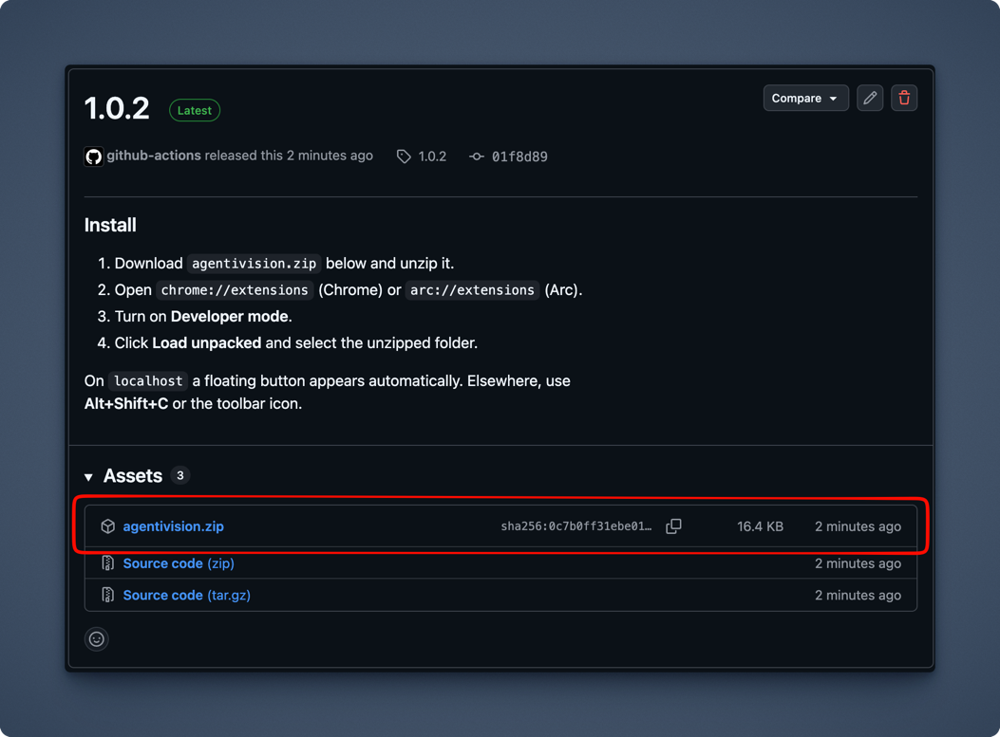

# TapThat

Comment on a **live webpage** the way you comment on a design — then either export the
feedback as a prompt for your coding agent, or have an agent apply it to the running dev
site within seconds.

Chromium MV3 extension — works in Chrome and Arc.

```
hover an element  →  click  →  type "make this green"  →  Export or Apply
```



## Two ways to run it

|  | **TapThat Light** | **TapThat Full** |
| --- | --- | --- |
| What it does | Comment → **Export** → paste into your agent | Comment → **Apply** → the change appears in the dev site |
| Install | Load the extension. That's it. | Extension **+** a sidecar beside your dev server |
| Needs | Nothing | Node or Docker, a git checkout, a Claude credential |
| Who it's for | Developers with the repo already open | Designers, PMs, QA — no checkout, no CLI |
| Network | None. The extension never phones home. | Extension ↔ your own sidecar, on your own network |

**It's one extension, not two downloads.** Light is what you get out of the box.
Configuring a sidecar URL in the options page is the entire difference between the two,
and clearing it puts you back in Light.

---

## Install — Light

**From a release** (no tooling needed):

1. Download `tapthat.zip` from [the latest release](../../releases/latest) and unzip it.
   
2. Open `chrome://extensions` (Chrome) or `arc://extensions` (Arc).
3. Turn on **Developer mode**.
4. Click **Load unpacked** and select the unzipped `tapthat` folder.

**From source:**

```bash
git clone <this repo> && cd tapthat
npm install
npm run build
```

Then load unpacked as above, selecting `packages/extension/`.

That is the whole install. Light needs no server, no account and no configuration.

### Use

Activate annotation mode in any of three ways:

- The **floating button**, which appears automatically on localhost and other local dev
  hosts. Drag it anywhere; the position is remembered across pages and sessions.
- **Alt+Shift+C** (rebindable at `chrome://extensions/shortcuts` or `arc://extensions/shortcuts`)
- The toolbar icon

| Action | Result |
| --- | --- |
| Hover | Blue border tracks the element under the cursor |
| `↑` / `↓` | Walk up to the parent element, or back down |
| Click | Freeze that element and open the comment box |
| `⌘↵` | Save the comment |
| `Esc` | Cancel the comment, or exit annotation mode |
| Click a pin | Reopen a comment to edit, resolve or delete it |
| **Export** | Copy all open comments as one markdown prompt to the clipboard |

Paste the result into Claude Code (or any agent) pointed at the app's repo.

Comments persist per-URL in `chrome.storage.local`, so they survive reloads and SPA
navigation. Pins stay visible after you exit annotation mode; if a commented element no
longer exists, its pin greys out and the export flags it as stale.

### Resolving

Mark a comment resolved with the ✓ in the panel, or **Resolve** in the comment box.
Resolved comments disappear from the page — no pin, no badge count — and are **left out of
exports**, so an agent is never asked to redo finished work.

They aren't deleted. The **Resolved (n)** button next to *Clear all* switches the panel to
the resolved list, where ↩ reopens a comment and ✕ deletes it for good.

---

## Install — Full

**Step-by-step instructions for both halves are in [INSTALL.md](INSTALL.md).** In short:

> ⚠️ **The sidecar must never run in production.** It accepts instructions that modify
> your repository, and it is a development tool only. See [docs/security.md](docs/security.md)
> for the isolation guards and why each one exists.

Full adds a **sidecar**: a small process that runs beside your dev server, in the same
working tree. When a reviewer hits Apply, the sidecar runs an agent over your repo, your
dev server's HMR pushes the change to their browser, and the edit is committed.

```
Chrome extension ──POST──▶ sidecar ──claude -p──▶ edits files
                                          ├─▶ HMR pushes to the browser   (~15-45s)
                                          └─▶ git commit (+ push, optional)
```

**1. Run the sidecar.** In the repo you want edited, on the branch the agent should
commit to:

```bash
npm i -D @tapthat/sidecar          # devDependency only, never a production dep
npx tapthat-sidecar init           # writes tapthat.config.json + secrets, prints what to paste
TAPTHAT_ENABLE=1 npx tapthat-sidecar
```

For Docker Compose and hosted dev environments such as Railway, see
[docs/setup.md](docs/setup.md).

**2. Point the extension at it.** In the extension's options page, paste the **Sidecar
URL** and **token** that the sidecar printed, then **Save & test**. The allowed sites fill
in from the sidecar. Paste your Claude credential once: it is sent to the sidecar, stored
there encrypted, and never kept in the browser.

An **Apply to dev** button appears next to Export on your dev site. Export keeps working
as the fallback whenever the sidecar is down.

**3. Verify.** `curl http://localhost:7420/healthz` should say `"status":"ok"`. Then
comment "make this text red" on the dev site, press Apply, and confirm **in order**:

1. The panel moves through queued → editing → live → committed.
2. The browser updates without a manual refresh.
3. `git log` on the branch shows a new commit.

If step 2 fails but step 3 succeeds, the shared working tree or the file watcher is the
problem, not the agent. See [docs/troubleshooting.md](docs/troubleshooting.md).

---

## What gets exported

Per comment: a verified-unique CSS selector, a readable DOM path, the element's text and
HTML, the enclosing landmark and its heading, sibling position, size and position, and the
non-default computed styles.

```markdown
## 1. Make this button green and a bit larger than the other two.

- **Element:** `<button class="btn btn-primary">`
- **Selector:** `div.card:nth-of-type(3) > button.btn.btn-primary`
- **DOM path:** `body > div#root > main > section.pricing > div.grid > div.card > button.btn.btn-primary`
- **Text:** "Choose"
- **Location:** in `<section class="pricing">` — nearest heading: "Team"
- **Position:** child 3 of 3 · 148 × 44 at (612, 430)
- **Key styles:** `display: inline-block; padding: 8px 14px; border-radius: 6px`
```

Both modes send the same payload — Export writes it to your clipboard, Apply sends it to
the sidecar. One builder renders both, so they cannot drift apart.

Three decisions drive the quality of that payload:

- **Generated class names are rejected.** `css-1a2b3c4`, `sc-bdVaJa`, `kXhFjL`,
  `Button_root__x7f3a` and Tailwind arbitrary values change between builds, so a selector
  built on them is dead on arrival. See `isStableClass` in
  `packages/extension/src/content/capture.ts`.
- **Selectors keep a greppable anchor.** A chain of bare tags (`div > div > span`) can be
  unique yet tells an agent nothing, so the builder keeps walking for a named ancestor
  rather than settling for the first unique result.
- **Headings are scoped to their own landmark.** A heading borrowed from an earlier,
  unrelated section reads as authoritative and sends the agent to the wrong file, so it's
  omitted rather than guessed.

## Develop

npm workspaces monorepo — run everything from the repo root:

```bash
npm run dev       # watching build of the extension
npm run check     # typecheck + tests + production build, across workspaces
npm test          # every test suite, in every workspace
npm run package   # build packages/extension/tapthat.zip
```

The sidecar's suites run a fake agent (`packages/sidecar/test/fake-agent.mjs`) against real
git repositories, so the whole Apply lifecycle is tested without an API key.

| Package | What it is |
| --- | --- |
| `packages/extension` | The Chromium MV3 extension. Private. |
| `packages/shared` | Types, HTTP protocol, and the one prompt builder. Private, never published. |
| `packages/sidecar` | `@tapthat/sidecar` — the agent runner. Published to npm and ghcr. |

`packages/extension/test/fixture.html` is a deliberately hostile page — repeated identical
markup, framework hash classes, Tailwind arbitrary values, deep anonymous nesting. Serve it
and annotate it by hand to exercise the extension:

```bash
npm run fixture   # then open http://localhost:8731/fixture.html
```

Because it's on localhost, the floating button appears automatically.

`node packages/extension/test/sample-export.mjs` prints a complete export built from that
fixture — use it to review the exact payload after changing `capture.ts` or the prompt
builder.

### Releasing

**The sidecar** is released by pushing a tag: `git tag sidecar-v0.2.0 && git push origin
sidecar-v0.2.0` publishes `@tapthat/sidecar` to npm (needs the `NPM_TOKEN` secret) and
`ghcr.io/ljellevo/tapthat-sidecar` to ghcr. Make the ghcr package public once, after the
first release, so Railway and Compose can pull it without credentials.

**The extension** releases are automatic. Every push to `main` that touches the extension builds, tests,
packages and publishes a release, bumping the hotfix number (`major.minor.hotfix`) from the
latest tag — no manual version bump or tag push needed.

For a major or minor bump, run the *Release* workflow manually from the Actions tab (or
`gh workflow run release.yml -f version=1.1.0`) and type the version to release.

## Known limitations

- **Iframes aren't supported** (`all_frames: false`). Elements inside an iframe can't be
  selected.
- Selectors are captured against the page as it was. Heavily dynamic lists may re-anchor to
  a different item after a data change; such pins are flagged stale only when the selector
  resolves to nothing at all.
- Pages the browser blocks content scripts on (`chrome://`, `arc://`, the Web Store, PDF
  viewer) can't be annotated.

## License

MIT — see [LICENSE](LICENSE).
